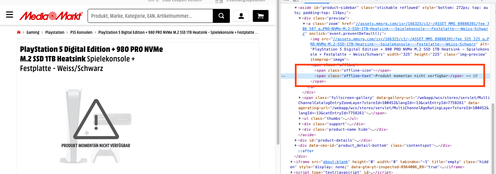

### So you want to buy a PS5?

A Playstation 5 is pretty hard to get at the moment. I really wanted one and asked in a couple of stores. They all told me that they have a huge waiting list and won't even add me to it. When searching the internet I found a couple of pages where people would notify others when they saw an offer online. One for Switzerland is called https://www.preispirat.ch/. But whenever I saw a new post, it was already gone. So I decided to write my own small bot to notify me in Telegram was soon as one is available. I thought I need to wait for a week or so, but within a day I got multiple notification and was able to get a PS5. The setup is super simple and can be used for other shopping endeavours as well.

I checked https://www.mediamarkt.ch/ and saw that the have a handy text in the DOM, which I can use to determine when they are sold out. In case the text won't show up, I'll notify myself in Telegram.



### The bot

The bot itself is a simple python script that requests the page and then checks if the sold-out text is not present. In that case it will send the message.

```python
import telegram_send
import requests

url = "https://www.mediamarkt.ch/de/product/_sony-ps-playstation-5-digital-edition-980-pro-nvme-m-2-ssd-1tb-heatsink-2105983.html"

r = requests.get(url)

if "Produkt momentan nicht verfügbar" not in r.text:
    telegram_send.send(messages=[f"PS5 is available on {url}"])
```

### Automation

I was running this on a small cloud server, but you can also run it on your own machine. First install telegram-send `pip3 install telegram-send` and requests `pip3 install requests`.

Run `telegram-send --configure` to configure telegram-send. It will walk you through on how to setup a telegram bot and connect to it.

Check if everything works fine and then setup a cron to run the script every 5 minutes. Edit your crontab:

```bash
$ crontab -e
```

and insert this line:

```bash
$ */5 * * * *  python3 /bytesonly/ps5-python.py
```

Then sit back and wait:


Good luck and happy shopping.
