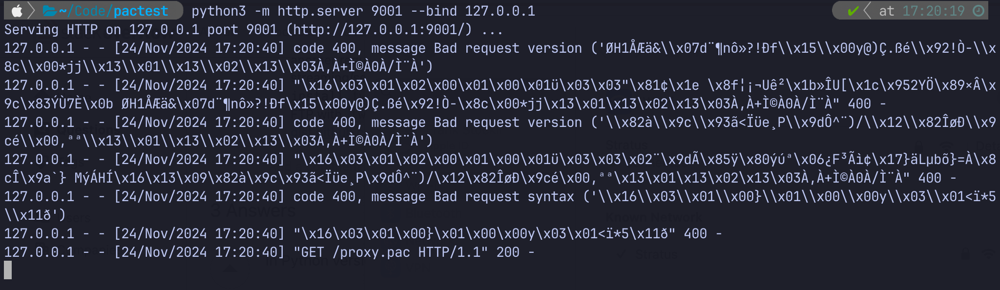

# The fabulous world of pac files

## Prelude

This is the story of how I fell into the rabbit whole of proxy automatic configuration (or short PAC) files. My company lets me connect to their network by vpn. But we also use cloud services like Github. The enterprise Github is secured by a ip allow list, so it can only be accessed from legitimate devices. In our case that traffic coming from the outgoing forward proxy. The vpn somehow doesn't route all traffic through that proxy, so this needs to be configured on the client machine. So far so good, let's get started.

## The simple solution

On macOS you can go to WI-FI Settings > Your wifi name > Proxies. Lets set the HTTP and HTTPS proxy to "proxy.company.ch" and the port to 8080. Now I can access Github without any issues. I can work and everything is fine, until I want to google something. Wait what? Google.com gives me an error. And so does pretty much the rest of the internet. I get a ERR_TUNNEL_CONNECTION_FAILED. Looks like the vpn can't resolve any other hostnames than github.com and a few other ones. Probably this was configured by hand or there is no proper dns resolver configured? I'll probably never know. If there would only be a way to tell the system to use the proxy only for certain domains. Enter the world of PAC files.

## The PAC file

Luckily the company is hosting a PAC file. The Proxy auto-config file defined how web browsers and other user agents can automatically choose the appropriate proxy server for fetching a given URL. The file contains the JavaScript function `FindProxyForUrl(url, host)`, which returns a string with one or more access methods.

Let's look at the file that my company provides:

```js
function FindProxyForURL(url, host) {
  PROXY = "PROXY proxy.company.com:8080";
  
  if (shExpMatch(host, "*github.com|*.some-other-domain.com")) {
    return PROXY;
  }
  
  return "DIRECT";

}
```

Cool. Send traffic to github.com and other important domains through the proxy and everything else not.

Let's just use that file. Go to WI-FI Settings > Your wifi name > Proxies. Turn automatic proxy configuration on and set the URL to https://company.com/proxy.pac or whatever the link to the pac file is. As soon as you click ok the file is loaded from the server. However, in the browser everything is like before. That's because the browser loads the pac file on startup. So let's close the browser and open it again. Cool Github.com works and so does the rest of the internet. All fixed, let's get to work. I use IntelliJ and there is this neat feature to see Github Pull Requests in the IDE. But wait, it's not working. Let's go to the IntelliJ Settings > Proxy and activate "Auto-detect proxy settings". It still doesn't work. Maybe I also need to specify the PAC file location explicitly: Click on "Automatic proxy configuration URL" and set the URL there. Maybe the IDE just needs a restart. Still nothing. What domains does the PR plugin connect to? I start a local intercepting proxy and point IntelliJ there, so I can analyse the traffic. It sends some POST requests to https://api.gitbhub.com/graphql.

Isn't that strange? `api.github.com/graphql` should definitely match `*github.com`. Let's verify this online [with a pac file tester](https://thorsen.pm/proxyforurl). The url `http://api.github.com/graphql` returns PROXY and so does `http://github.com`. Let's try it also [on this page](https://pactester.online/) for good measure. Same. How come IntelliJ is not sending this traffic to the proxy, but the browser is?

I fire up a transparent proxy, so I can do a man-in-the-middle and analyze the requests and responses in detail: `mitmproxy -p 9001 --mode upstream:http://company.proxy.com:8080`. There are a couple of requests being made, all of them go to api.github.com. And guess what: The feature itself now works in IntelliJ. So it's not really the proxy behaving weird and it must have something to do with the pac handling in IntelliJ. So I create my own pac file I can play around with.

## What the PAC!

Let's try to find a pac configuration that works for my use-case. There are rumors that you can use a local pac file, so I add `file:///Users/myuser/proxy.pac` in the wifi settings and make a simple config to redirect all traffic to mitmproxy:

```js
function FindProxyForURL(url, host) {
  return "PROXY localhost:9001";
}
```

That doesn't so anything. My experience is the same as these guys had [here](https://serverfault.com/questions/957519/why-does-file-users-username-library-proxy-pac-not-work-in-macos). And [this discussion](https://discussions.apple.com/thread/251395256?sortBy=rank) never got an answer but 150 upvotes. Then I host my own pac file on a server.

## The hosted PAC

I use the same pac file and start a webserver in that directory: `python3 -m http.server 9001 --bind 127.0.0.1`

Then I set the PAC config to the hosted file: `http://localhost:9001/proxy.pac`. Now that I have a solution, that actually works, I can play around with the config.

I immediately notice that there are a bunch of requests as soon as I click ok:



This makes sense, because it needs to fetch the new config. But there is also a request as soon as I open Chrome or IntelliJ. Why is that? I thought that the network interface somehow routes the traffic to the correct location, but that's not how it works. When I specify a pac file in the WIFI settings AND I configure a client application to use the system settings, then the client application gets, parses and evaluates the pac file itself.

A pac file has been invented by Netscape in 1996, so it's been around for a long, long time. It's just a JavaScript file, with a bunch of helper or utility functions that are available. A pac file contains the one function `FindProxyForURL`. Inside the function the helpers like `shExpMatch` and `isInNet` are available. For parsing a JS file you need a JavaScript Engine. Luckily the browser already has a JS engine. It fetches the file, parses it, evaluates the code and applies to rules for redirecting the traffic. But where do those helper function come from? Well, they are baked in the browser. They are only available in a small sandbox called `pac-sandbox` inside the JS engine. This is also the place where the pac file is being executed.

We can see the implementation of the helper function shExpMatch in [Chromium](https://chromium.googlesource.com/chromium/src/+/refs/heads/main/services/proxy_resolver/pac_js_library.h#116) and in [Spidermonkey](https://searchfox.org/mozilla-central/source/netwerk/base/ascii_pac_utils.js#72)

The implementation is the same:

```js
function shExpMatch(url, pattern) {
  pattern = pattern.replace(/\./g, "\\.");
  pattern = pattern.replace(/\*/g, ".*");
  pattern = pattern.replace(/\?/g, ".");
  var newRe = new RegExp("^" + pattern + "$");
  return newRe.test(url);
}
```
We can see that this implementation can handle the pipe. Let verify it to be sure:

```js
console.log(shExpMatch("http:test.example1.com", "*.example1.com|*.example2.com")) // ==> true
```


And what if a client doesn't bring its own JS engine already. Probably they use the [pacparser library](https://github.com/manugarg/pacparser). This one too needs a JS engine and the library already bundles Spidermonkey. So maybe that's what IntelliJ does, maybe they wrote their own implementation.

Whichever is the case, the most likely reason that it doesn't work is that there is a bug in IntelliJ shExpMatch implementation. Let's see if this is the case.

## The bug

The expression `shExpMatch(host, "*.github.com|*.example.com)` evaluates to `true` in Chrome, Firefox and Pacparser for host github.com and api.github.com. And it evaluates to `false` in IntelliJ. [Finally, we found the bug](https://youtrack.jetbrains.com/issue/IDEA-364083/Proxy-implementation-cant-deal-with-pipe-in-shExpMatch-function-of-a-PAC-file) Without the pipe | is all evaluates to true. It's the pipe that IntelliJ can't handle!

The `shExpMatch` Function is [highly suspicious](https://stackoverflow.com/questions/36362748/exactly-what-kind-of-matching-does-shexpmatch-do):

- findproxyforurl.com - "Will attempt to match hostname or URL to a specified shell expression"
- Microsoft - "The shExpMatch(str, shexp) function returns true if str matches the shexp using shell expression patterns."
- Mozilla "Currently, the patterns are shell expressions, not regular expressions."

What the hell is a shell expression anyway? What kind of matching does it do?

# The fix

I need to circumvent the pipe. I could just write it like this:

`if (shExpMatch(host, "*.github.com) || shExpMatch(host, "*.example.com)`

But I want to stay away from shExpMatch for the rest of my life. So this seems a cleaner more stable solution:

```js
function FindProxyForUrl(url, host) {
  PROXY = "PROXY company.proxy.com:8080";
  
  if  (dnsDomainIs(host, "github.com")) return PROXY;
  if  (dnsDomainIs(host, "example.com")) return PROXY;
  
  return "DIRECT";
}
```

## The takeaways

Cool, I have a working solution and learned a ton along the way. My key takeaways are the following:

- If a pac file is specified in the WIFI settings, it doesn't route any traffic per se yet. It's merely a place where client applications can look up the URL to fetch, parse and evaluate the file.
- On macOS the pac file only works when it's hosted on a web-server. The local file with `file:///path-to-file/proxy.pac` has no effect.
- In IntelliJ a pac file in UTF-8 only works [if it doesn't use BOM](https://www.jetbrains.com/help/idea/settings-http-proxy.html). One more trap alone the way.
- In IntelliJ the shExpMatch Function breaks when there is a pipe (|) in the shell expression 
